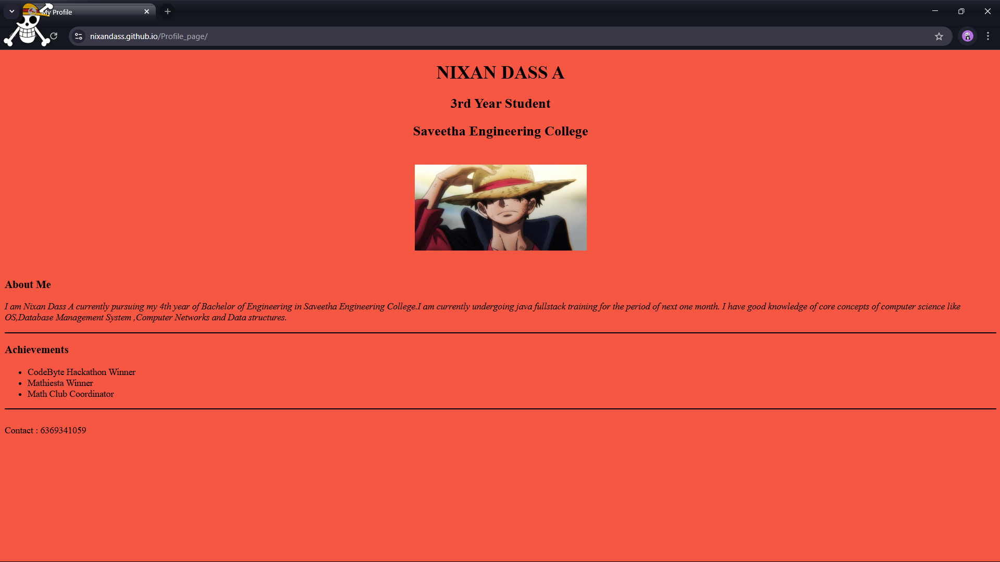

# Profile Page
## Date:07/07/2025
## Objective:

To design a simple Profile Page using HTML that displays a user's profile image, name, headings, and a short bio, suitable for personal or academic purposes.

## Tasks:

#### 1. Set Up the HTML Structure:

Use ```<!DOCTYPE html>```, ```<html>```, ```<head>```, and ```<body>``` tags to define the basic structure.

Add an appropriate <title> such as "My Profile".

#### 2. Add Page Headings:

Insert a main heading using ```<h1>``` for the user's name.

Include subheadings such as ```<h2>``` or ```<h3>``` for titles or roles (e.g., "Student", "Web Developer").

#### 3. Insert a Profile Image:

Use the `````` tag to display the user’s profile picture.

Add alt text and set basic attributes like width and height.

#### 4. Include a Short Bio Section:

Add a paragraph using <p> to provide a short introduction or biography.

The content may include education, interests, or a personal statement.

#### 5. Organize Content Using HTML Elements:

Use ```<section>```, ```<div>```, or ```<article>``` for logical grouping.

Add a horizontal line (```<hr>```) to separate sections.

#### 6. Keep the Design HTML-Only:

Do not use CSS or JavaScript.

Focus on semantic HTML and readability.
## HTML Code:
```
<!DOCTYPE html>
<html lang="en">
<head>
    <meta charset="UTF-8">
    <meta name="viewport" content="width=device-width, initial-scale=1.0">
    <title>My Profile</title>
</head>
<body bgcolor="#f55742">
    <header>
    <h1 align="center">NIXAN DASS A</h1>
    <h2 align="center">3rd Year Student</h2>
    <h2 align="center">Saveetha Engineering College</h2>
    </header>
    <main align="center">
        
        <article>
            <h3 align="left">About Me</h3>
        <section>
            <p align="left"><i>
            I am Nixan Dass A currently pursuing my 4th year of Bachelor of Engineering
            in Saveetha Engineering College.I am currently undergoing java fullstack training for the period of next one month.
            I have good knowledge of core concepts of computer science like OS,Database Management System ,Computer Networks and Data structures.
        </i>  
        </p>
        </section>
        <hr color="black">
        <h3 align="left">Achievements</h3>
        <section>
            <ul align="left">
                <li>CodeByte Hackathon Winner</li>
                <li>Mathiesta Winner</li>
                <li>Math Club Coordinator</li>
            </ul>
        </section>
        <hr color="black">
        
        </article>
    </main> 
    <br>
    <footer >
        Contact : 6369341059
    </footer>
    
</body>
</html>
```
## Output:

## Result:
A simple Profile Page using HTML that displays a user's profile image, name, headings, and a short bio, suitable for personal or academic purposes is designed successfully.
